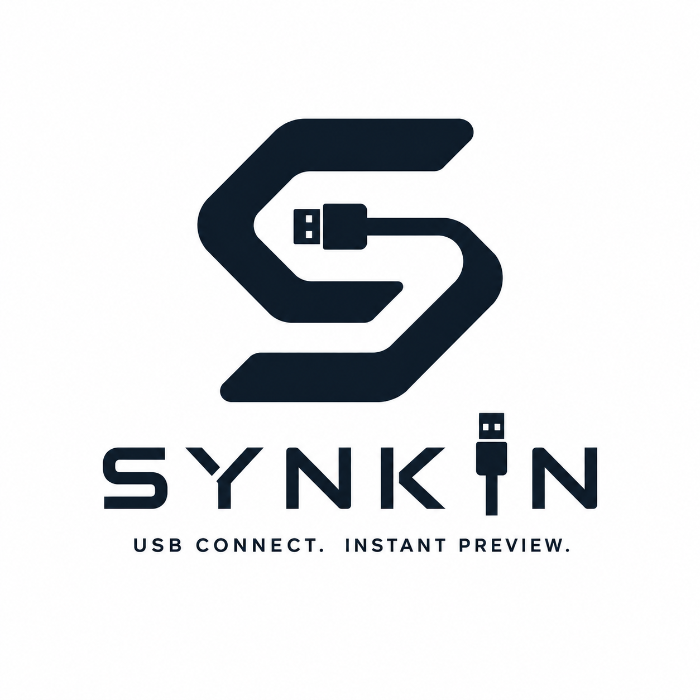

<div align="center">

# Synkin — Test Localhost on Android over USB



**Instantly preview your local web apps on Android — over USB.**

[](https://www.npmjs.com/package/synkin)
[](#license)
[](#requirements)
[](https://npmjs.com/package/synkin)

[Install](#installation) · [Usage](#usage) · [Visit our website](https://owsam22.github.io/synkin-page) · [Report an issue](https://owsam22.github.io/synkin-page/#feedback)

</div>

---

Synkin is a free, open-source npm CLI for **testing localhost websites on Android over USB**, using Android Debug Bridge (**ADB Reverse**) instead of Wi-Fi, a local IP address, or a public tunnel.

It maps your Android device's `localhost` directly to your computer's `localhost` over a USB cable. Because your app keeps running on `localhost` — not a LAN IP or tunnel domain — your existing Google OAuth, Firebase Authentication, Clerk, Auth0, Supabase Auth, cookies, sessions, WebSockets, and backend APIs continue working exactly as they do on desktop, with no CORS changes and no new OAuth redirect URIs.

Synkin automatically detects React, Vite, Next.js, Express, FastAPI, Flask, Django, and static HTML projects, forwards the right ports, and launches Chrome on your Android device the moment it's ready — no Wi-Fi, no firewall rules, no manual IP configuration.

```bash
npm install -g synkin
```

```bash
synkin run
```

## 🎬 Demo

<p align="center">
  
</p>

>For a visual walkthrough, check out the **[website](https://owsam22.github.io/synkin-page)**.

---

## Contents

- [Features](#features)
- [Authentication support](#authentication-support)
- [API support](#api-support)
- [Why Synkin](#why-synkin)
- [Requirements](#requirements)
- [How it works](#how-it-works)
- [Installation](#installation)
- [Usage](#usage)
- [Typical workflow](#typical-workflow)
- [Supported frameworks and tools](#supported-frameworks-and-tools)
- [Project detection](#project-detection)
- [Static HTML projects](#static-html-projects)
- [Notes for Vite users](#notes-for-vite-users)
- [Perfect for](#perfect-for)
- [Troubleshooting](#troubleshooting)
- [FAQ](#faq)
- [Release notes](#release-notes)
- [Contributing](#contributing)
- [License](#license)

---

## Features

| | |
|---|---|
| 🚀 **One-command setup** | Run a single command and the bridge configures itself. |
| 🔌 **USB-only connection** | No Wi-Fi, no shared network, no exposed ports. |
| 📱 **Automatic Chrome launch** | Opens your project on the device the moment it's ready. |
| 🔍 **Automatic project detection** | Recognizes your framework by scanning the current directory. |
| ⚡ **Automatic port discovery** | Finds the ports your servers are running on — nothing to specify. |
| 🔄 **Frontend + backend together** | Bridges both at once, in a single run. |
| 🌐 **Works with localhost APIs** | Backend requests are tunneled through ADB Reverse. |
| 🧹 **Cleans up on exit** | Disconnect the cable or stop Synkin and everything unwinds automatically. |
| 💻 **Cross-project support** | Use it in any project directory, no per-project config. |

---

## Authentication support

Because Synkin preserves the browser origin as `localhost`, authentication providers configured for localhost keep working without any changes — no new OAuth client IDs or redirect URIs required.

Tested and working with:

- Google OAuth
- Firebase Authentication
- Clerk
- Auth0
- Supabase Auth
- Auth.js
- Passport.js
- Better Auth

---

## API support

Synkin automatically forwards frontend and backend ports using ADB Reverse, so your app keeps calling the same URLs it already uses locally — for example `http://localhost:3000/api` or `http://localhost:8000`.

REST APIs, GraphQL APIs, WebSocket servers, and local development backends all continue working exactly as they do on desktop, with no URL or CORS changes required.

---

## Why Synkin

Testing on a real Android device usually means doing one of the following first:

- Finding your local IP address
- Connecting both devices to the same Wi-Fi network
- Opening firewall ports
- Updating backend API URLs
- Reconfiguring CORS
- Adding new Google OAuth origins
- Spinning up a temporary tunneling service

Synkin removes all of that by using ADB Reverse over USB. Your Android browser opens `http://localhost:5173` — not `http://192.168.x.x:5173`, and not `https://random-tunnel.example.com` — so your app behaves exactly like it does on your desktop.

| Before Synkin | With Synkin |
|---|---|
| ✕ Find your local IP address | ✓ USB only |
| ✕ Disable your firewall | ✓ `localhost` just works |
| ✕ Configure the LAN | ✓ Automatic device discovery |
| ✕ Change backend URLs | ✓ Chrome launches on its own |
| ✕ Reconfigure CORS | ✓ Backend requests work out of the box |
| ✕ Reconnect after every restart | ✓ Zero configuration |

---

## Requirements

- Node.js 18+
- An Android device
- A USB cable
- USB debugging enabled on the device
- [Android Platform Tools (ADB)](https://developer.android.com/tools/releases/platform-tools)

Verify ADB is installed:

```bash
adb version
```

Verify your device is recognized:

```bash
adb devices
```

Expected output:

```text
List of devices attached
2201116PI    device
```

---

## How it works

Synkin never exposes your application to the internet. Instead, it:

1. Detects your running development server
2. Detects your connected Android device
3. Creates ADB Reverse port mappings
4. Opens Chrome automatically
5. Lets Android access your computer's `localhost` directly

Because Android still accesses your application through `localhost`, the browser origin remains `http://localhost`. Existing authentication, cookies, sessions, CORS policies, backend APIs, and WebSocket connections continue working exactly as they do in your desktop browser.

---

## Installation

Install globally with npm:

```bash
npm install -g synkin
```

Verify the installation:

```bash
synkin --version
```

To update later:

```bash
npm update -g synkin
```

---

## Usage

**1. Start your frontend**

```bash
npm run dev
```

**2. Start your backend** *(optional)*

```bash
npm run dev
```

**3. Connect your Android phone via USB**

**4. Run Synkin**

```bash
synkin run
```

Synkin will then:

- Detect your Android device
- Discover your running project
- Detect frontend and backend ports
- Configure ADB Reverse
- Launch Chrome automatically
- Open your project on the phone

---

## Typical workflow

```bash
# Terminal 1
cd frontend
npm run dev
```

```bash
# Terminal 2
cd backend
npm run dev
```

```bash
# Terminal 3
synkin run
```

That's it — your project is live on-device.

---

## Supported frameworks and tools

| Frontend | Backend | Database |
|---|---|---|
| React | Express.js | MongoDB |
| Vite | NestJS | PostgreSQL |
| Next.js | FastAPI | MySQL |
| Angular | Flask | SQLite |
| Static HTML | Django | |

Database support means Synkin doesn't interfere with your backend's own connection — as long as your backend server is running, its database connection works exactly as it would locally.

>If your development server listens on a localhost port, Synkin can usually bridge it automatically.

Synkin also works with most other local development servers and stacks, including:

`React Scripts` · `Vue` · `Svelte` · `Remix` · `Astro` · `Angular CLI` · `NestJS` · `Laravel` · `Spring Boot` · `Node.js HTTP Server` · `Python HTTP Server` · `Bun` · `Deno` · `Prisma` · `Firebase` · `Supabase` · `REST APIs` · `GraphQL` · `WebSockets`

More frameworks will be added in future releases.

---

## Project detection

Synkin automatically detects supported projects by scanning the current directory — no configuration required.

<details>
<summary>Detected project types</summary>

```
React
Vite
Next.js
Angular
Express
NestJS
FastAPI
Flask
Django
HTML
```

</details>

---

## Static HTML projects

Synkin also supports simple static sites. Serve your files however you like:

```bash
python -m http.server 5500
```

```bash
npx serve .
```

Then run:

```bash
synkin run
```

---

## Notes for Vite users

Your Vite server must be reachable through ADB Reverse. If it's only listening on `127.0.0.1`, Android Chrome can't reach it through the bridge — enable `server.host` in `vite.config.ts`:

```ts
server: {
  host: true,
},
```

---

## Perfect for

- Mobile responsive testing
- Google OAuth testing
- Camera API testing
- Touch interaction testing
- PWA testing
- Android Chrome debugging
- Backend API development
- Full-stack application development

---

## Troubleshooting

**Device not detected**

Check the connection:

```bash
adb devices
```

Make sure these are enabled on the device:
- USB debugging
- File transfer mode

**Chrome doesn't open**

Confirm Google Chrome is installed on the Android device.

**Project not found**

Run Synkin from inside your project folder:

```bash
cd my-project
synkin run
```

**Backend requests fail**

Make sure your backend server is running *before* starting Synkin.

**Chrome says "This site can't be reached"**

Make sure your `vite.config.js` includes:

```ts
server: {
  host: true,
},
```

---

## FAQ

**How is Synkin different from ngrok or Cloudflare Tunnel?**

Unlike public tunneling services, Synkin never exposes your application to the internet. It uses Android Debug Bridge (ADB Reverse) to map your Android device's localhost directly to your computer's localhost over USB, preserving the original localhost browser origin.

**Does Synkin work without Wi-Fi?**
Yes. Synkin only requires a USB connection and ADB.

**Does Synkin expose my application to the internet?**
No. Everything stays on your local machine.


**Does Google OAuth continue working?**
Yes. Since Android accesses your application through `localhost`, existing localhost OAuth configurations continue working unchanged.

**Do I need to change backend URLs?**
No.

**Does Synkin modify my project?**
No. Synkin only configures temporary ADB Reverse mappings — it never edits your project files.

---

## Release notes

Full version history and changelogs are published on the [Synkin website](https://owsam22.github.io/synkin-page/#released).

---

## Contributing

Contributions, suggestions, and bug reports are welcome. If you find a bug or have an idea for an improvement, [open an issue](https://github.com/owsam22/synkin-page/issues).

## License

Released under the [MIT License](LICENSE).

---

<div align="center">

Made with ❤️ by **[Samarpan ~ owsam22](https://samarpan-portfolio.vercel.app)**

</div>